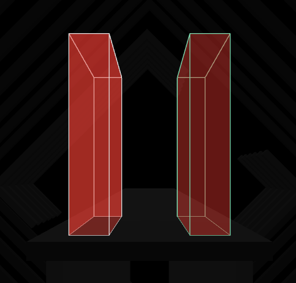

By default, walls pop into existence a few beats ahead of the player, and move at the same speed as the notes towards the player. 
Fast walls offer a way to tweak this behavior, and send walls shooting quickly towards the player.

> Fast walls are a very unstable feature with many caveats.
> They exploit a loophole in the game's programming, and there is a strong possibility these behaviors may be patched at some point in the future if they were not already.

Fast walls are differentiated with a green outline:

### Creating Fast Walls

By default, you are not able to directly place fast walls using traditional means.
To set a wall as "fast", you need to select it, click the "Change duration" button that will appear on the right-hand panel, and input a negative value when prompted. 

### Working with Fast Walls

Simply altering a wall to be "fast" won't guarantee that it moves by the player quickly. The _speed_ of the wall depends on its _duration_ and _start beat offset_.

By default, notes and obstacles spawn 2 beats away from the player. If a note is to be struck on Beat 16, it spawns in the distance on beat 14. 
"Start beat offset" is a way to tweak that value; it defaults to 0, and you can push the offset back further with positive numbers; 
a "start beat offset" of 1 means that notes and obstacles start 3 beats away from the player instead of 2.

With a default "start beat offset" of 0, here's some rough guidelines:

- A wall that lasts for a single beat won't be very fast at all, it moves at a normal-ish speed.
- A wall that lasts 2 beats moves noticeably faster; Shortly after spawning it accelerates towards the player
- A wall that lasts 3 beats moves very very quickly, though it still has the same spawn animation as any other wall.

Fast walls are sort-of the Wild West; not many people understand them that deeply, and they're seldomly used. Some experimentation is required to get a feel for them.

They can provide neat effects in certain songs, especially when combined with [Mapping Extensions](/docs/mods#mapping-extensions) to place the walls outside of the player's personal space. 
But they carry risks: modern updates have historically broken maps that use fast walls, so please be cautious.
