The "Beatmap" view covers everything you physically interact with in-game: the blocks you hit, the mines you avoid hitting, and the obstacles you dodge. 
But there's another big component to individual maps: events!

The "Lightshow" view lets you customize the lighting and ring motion. These background elements are responsible for a surprisingly big part of the map's look and feel.

To navigate to the "Lightshow" view, click the sun-shaped icon in the left sidebar:

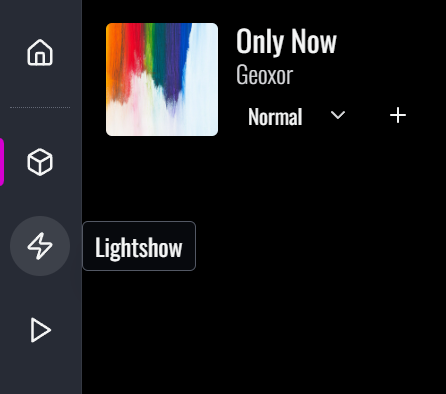

The "Lightshow" view takes inspiration from MIDI piano rolls in audio editing software. It looks like this:

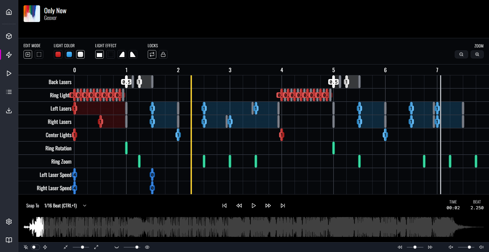

> This view can look a little weird/overwhelming, especially if you're coming from another mapping editor like ChroMapper or the official level editor. 
> Once you get the hang of it, though, this interface will let you create beautiful, advanced lighting patterns really quickly and easily. Give it a chance!

## Understanding the Interface

In Beat Saber, every component of an environment is controlled by a unique event type:

- Some components can be illuminated to a specific color and brightness, like the "tube light" that powers the chevron and laser beams.
- Some components have behaviors that can be controlled with a provided "value", like the speed of the side lasers.
- Some components have premade effects that can be "triggered" on-demand, like the rotation and zoom effects for cascading ring trails.

In Beatmapper's events view, every event type gets its own **track**. A track is a horizontal row that displays the events over a given period of time. 
For example, the "Large ring" track shows every "ring rotation" event, represented as a green vertical bar.

The events view collects all environments tracks in a **table**. The table shows a specific **window** of time, measured in beats. 
In the screenshot above, we see beats 0 through 8, since we're editing the very first section of the song.

A thick vertical yellow bar represents the song's current position. 
When you press <Shortcut>Space</Shortcut> to play the song, the yellow bar moves through the window, and will automatically advance to the next window:

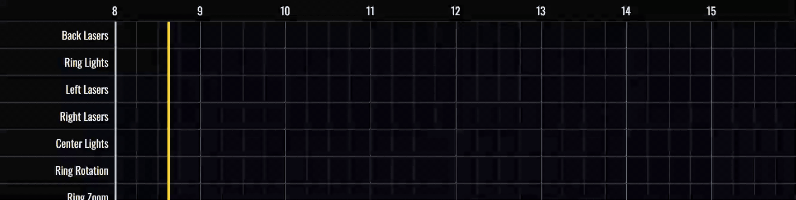

Unlike the "placement grid" in the notes view, however, events are not placed based on the yellow bar's position, instead, a thin white bar shows the cursor's current position:

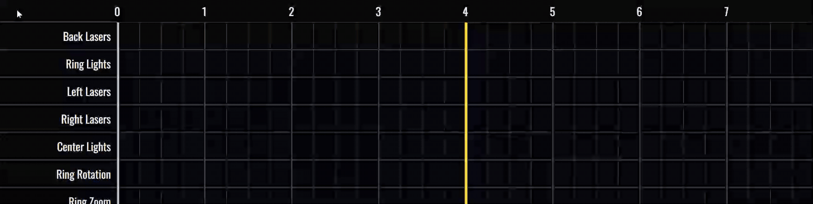

This white bar tracks the mouse position, but it snaps to the nearest "snapping interval". This is the same snapping interval from the notes view, located in the bottom left corner of the screen:

Finally, above the tracks you'll find a suite of **controls**. These controls change what happens when you interact with the tracks. We'll learn more about them below.

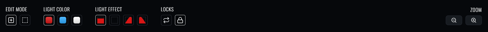

## Navigating Time

As you play the song, the window automatically advances when the song's position passes the current window. There are much more convenient ways to jump around though!

First, many of the tricks you learned in the "Beatmap" view will carry over. 
You can scrub the waveform, scroll with the mousewheel or arrow keys to seek forwards and backwards, and use the <Shortcut>J</Shortcut> key to jump to a specific point.

The media keys on either side of the "play" button take on a slightly different role in this view, though. The "next" button will automatically jump to the next window; 
If you're looking at beats 0-16, one press of the button will show you beats 16-32. The "previous" button rewinds to the start of the current window, and repeated presses will jump to previous windows.

> [!tip]
> For those of us old enough to remember how CD players work, it works the same way; 
> the "previous" button rewinds the current window, or jumps to the previous one if you're close to the beginning already.

Finally, you can click within the beat numbers along the top to scrub the current window:

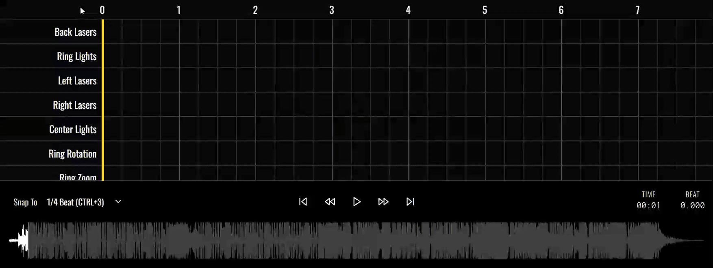

### Zooming

You can also change the size of the window using the **zoom buttons**. These are found on the right edge of the controls:

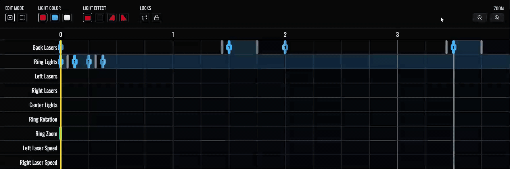

This changes the number of beats that fit in the window. You can zoom out to fit 32 beats, or zoom in to fit as few as 4 beats in the window. 
You can use the keyboard shortcuts <Shortcut separator="&">- & +</Shortcut>.

## Event Tracks

Beatmapper supports 3 types of event tracks, and they're a little distinct in how they function.

### Light Tracks

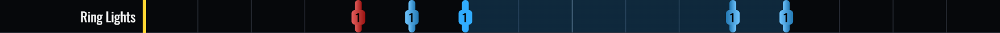

**Light** tracks control illumination - they're responsible for turning lighting components on and off, and altering their color and brightness. 

In Beatmapper, you control these lights by adding "Light" events.
A Light event is represented by a vertical pill that takes on the characteristics of the effect it produces.

The number displayed on the a Light event represents its brightness value. A value of 1 will display a light at full brightness, while a value of 0 will turn the light off. 
Any values above 1 will make the light illuminate with more intensity.

One last unique feature of these tracks: some events may produce a "background box" that indicates the current track status.
For example, below you can see a translucent red box between the on and off events:

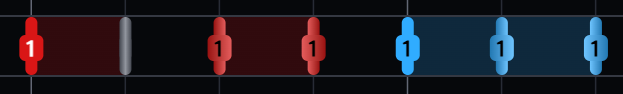

### Trigger Tracks

**Trigger** tracks will produce effects on-demand for specific components. 
You can think of them like a button: you can press that button whenever you like, but that's the extent of the control you have.

For example: in Beat Saber's default environment, there are two sets of rings that extend into the distance. 
These events will trigger "ring rotation" and "ring zoom" effects on those structures.

### Value Tracks

**Value** tracks operate similarly to Trigger events, but allow you to define an associated value for its produced effect.

For example: in Beat Saber's default environment, the two "side lasers" can have their speed controlled using a Value track.
Lasers with a speed of 0 won't move at all, and increasing the value will subsequently increase the rotational speed of the lasers.  

> Decimals are not supported for value events; the value defined for an event must be an integer starting from 0.

## Placing and Modifying Events

Clicking on a track will place an event at the current cursor position (the white vertical line that follows the mouse and snaps to the nearest increment).

The height at where you click relative to the track will determine the values associated with particular event types:

- For Light tracks, the height will determine the brightness of the event, from a range of 0 to 1 with a step of 0.5.
- For Value tracks, the height will determine the value of the event, from a range of 0 to 8 with a step of 1.

You can also adjust the value for both of these event types by hovering over an event, holding <Shortcut>option</Shortcut>, and scrolling forwards/backwards.
Updating the value in this manner will allow you to set values above the upper limit or at greater precision (in the case of Light events).

Right clicking an event will delete it, similar to the "Beatmap" view.

### Customizing Lighting Events

For lighting tracks, you can select the _color_ and _type_ of the lighting event. 
By default, clicking a lighting track will turn a red light on, but you can modify the color and type through the controls at the top:

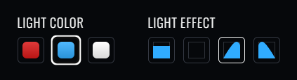

Manually clicking the controls is tedious, so it is recommended to use the keyboard shortcuts:

- For color, you can use <Shortcut>r</Shortcut> to select red lighting, and <Shortcut>b</Shortcut> to select blue lighting.
- For event types, you can use the numbers <Shortcut separator=" to ">1 to 4</Shortcut> (<Shortcut>1</Shortcut> for on, <Shortcut>2</Shortcut> for off, etc), 
  or you can use <Shortcut>tab</Shortcut> and <Shortcut>shift+tab</Shortcut> to toggle between tools.

> [!note]
> More information about shortcuts can be found on the [keyboard shortcuts](/docs/shortcuts) page.

### Bulk Placement

For all tracks, you can quickly place multiple events by clicking and dragging:

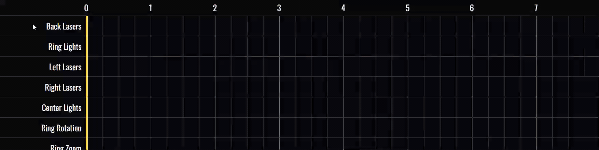

Note that the rate at which events are placed depends on the current _snapping interval_. By tweaking this value, you can quickly create strobes and other effects:

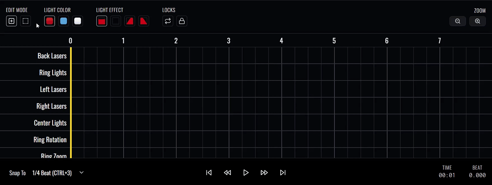

## Edit Modes

There are two editing modes: **Placement** and **Selection**. So far, we've been using Placement mode.

Placement mode works great for quickly placing events, but it's not so great for making bulk edits. 
While you _can_ click on events one at a time to select them, or right-click to delete, it's not the most expedient.

**Selection mode** turns your cursor into a crosshair, and it lets you draw boxes to select all events within its perimeter:

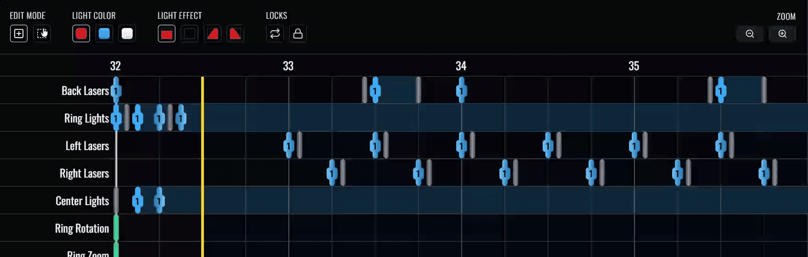

As in the notes view, events can be selected, and selected events glow yellow to indicate their status.

You can toggle between Placement and Selection mode through the "Edit Mode" control, or through their keyboard shortcuts: 

- <Shortcut>a</Shortcut> for Placement mode
- <Shortcut>s</Shortcut> for Selection mode.

## Managing Selections

Armed with the Selection mode box tool, we can quickly select groups of events. Let's look at how we can use selections to our advantage.

Sometimes we simply want to erase a section. We can do this by pressing <Shortcut>delete</Shortcut> - all selected events will be removed.

We can also cut, copy, and paste selections using the typical shortcuts. This is an effective way to move groups of events around (cut -> paste), or repeat a set of events (copy -> paste).

> [!note]
> Pasting is based on the mouse's cursor position, the thin white line, and _not_ the thick yellow line indicating the song's position. 
> This gives you much greater control to quickly paste repeated sections.

If you want to un-select all events, you can press the <Shortcut>escape</Shortcut> key. You can also select all _visible_ events by using <Shortcut>meta+a</Shortcut>.

> [!note]
> The "Select all" shortcut is slightly different between views; 
> in the "Beatmap" view, "Select all" selects all entities across the entire map, 
> whilst in the "Lightshow" view, it only selects events within the current window, visible on-screen.

When using the selection box, the active selection will be cleared automatically when a new selection is being made. 
Alternatively, you can keep the contents of previous selections by holding down the <Shortcut>meta</Shortcut> key when making a new selection.

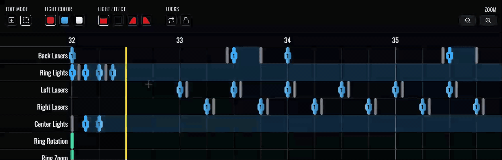

## Locks

After spending dozens of hours lighting maps in Beatmapper, I found two things kept annoying me. Locks are an optional feature you can use to address these situations.

### Window Lock

Normally, when playing a song, you want it to advance automatically from one window to the next when the song reaches the end of the current window.

Sometimes, you'll be editing something right at the tail end of the window, and it'll be annoying to constantly jump back to the previous window to re-listen to a section.

The "event window lock" loops playback within the current view of events, so the window no longer automatically advances:

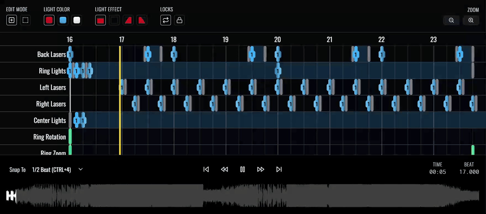

You can toggle it on or off with the <Shortcut>z</Shortcut> key.

### Mirror Lock

Certain environments feature symmetrical components, such as left and right lasers, where each element has its own respective event tracks. 
Often this flexibility is awesome, and allows for some great lighting effects, but sometimes you want to operate on these elements at the same time. 
It can be tedious recreating laser events and speeds twice for each side.

The "laser lock" disables the "right-side" tracks, and copies all actions you make in the left-side tracks to the corresponding right-side ones:

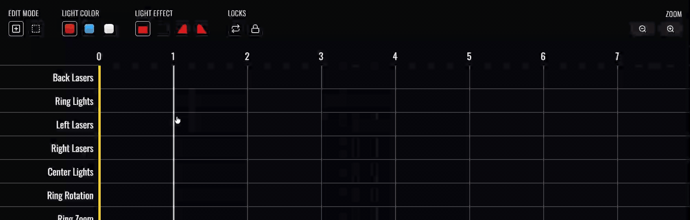

You can toggle it on or off with the <Shortcut>x</Shortcut> key.

## Integrated Previews

It takes a while to build up an intuition to be able to picture what a "Flash" event on the "Back laser" track looks like. 
Fortunately, Beatmapper makes it possible to preview your lighting events!

At the very bottom of the editor, you'll see a toggle and a couple sliders:

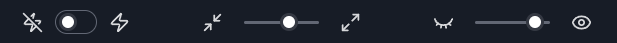

The first toggle enables the lightshow visualization. This allows you to view the lights at the same time as you edit the grid!

The sliders beside this toggle allow you to customize the height of each row, and how see-through the event grid is:

These configuration options will hopefully make it easier to find an arrangement that works for monitors of all sizes.
