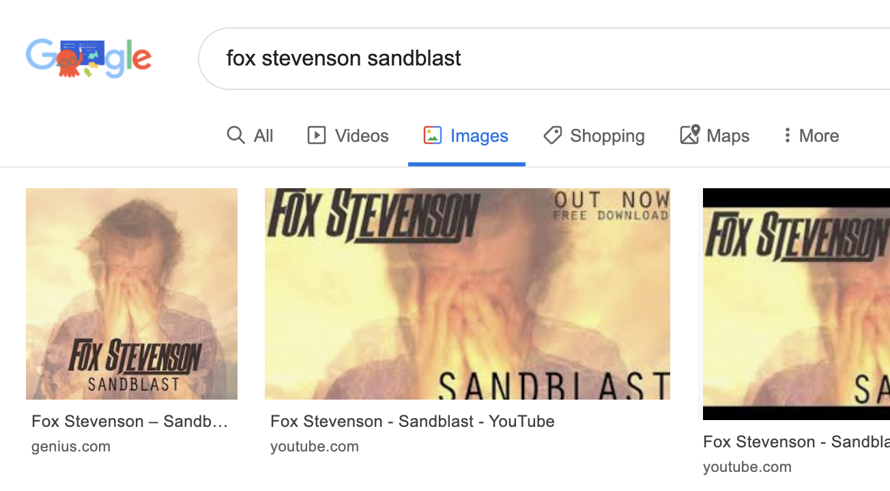
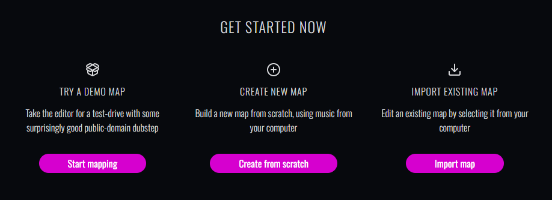
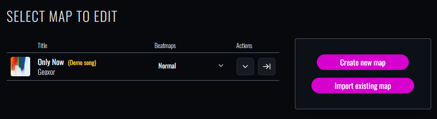
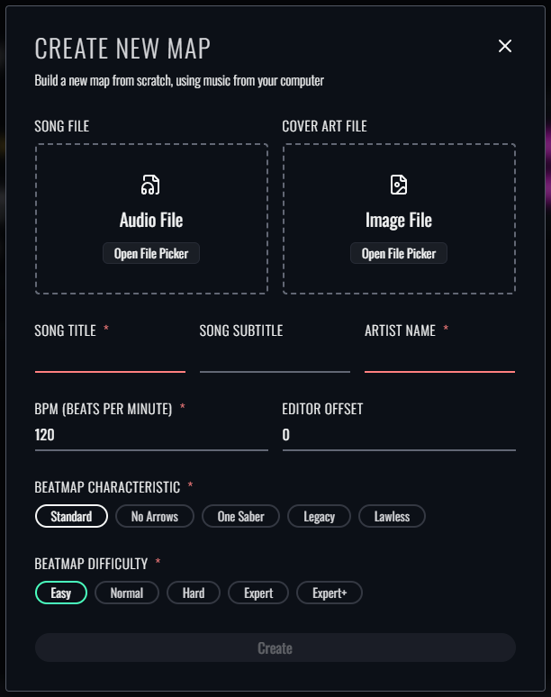

When you first visit [Beatmapper.app](https://beatmapper.app), you'll be presented with 3 options:

- Load a demo track
- Import an existing map
- Create a new map

For the quickest start, you can load the demo track, a short 1-minute edit of a public-domain dubstep track: [Only Now - Geoxor](https://soundcloud.com/geoxor/only-now). 

You can also import a map you've downloaded from [BeatSaver](https://beatsaver.com/) or created using another editor. 
Generally speaking, any map that is compatible with the most recent update of Beat Saber should be loadable and editable, 
although full support for modern beatmap features may not be available at this time.

- Currently, any maps that feature arcs/chains, BPM changes, NJS events, and/or certain modded data (Heck suite, Cinema, etc.) 
  will not be fully compatible with Beatmapper and *may be removed* when processing your map in the editor:
  If your map features any of these elements, **make sure you have a recent backup of your map available** before loading it into the editor.

While these options are great for getting a quick look at the editor and playing around, you'll likely want to create your own map. 
From this point on, we'll assume you're creating a new map from scratch.

## File Prep

Before we can start mapping, we need to get our assets in order. Specifically, we'll need:

1. A square cover art image in `.jpg` or `.png` format
2. An audio file in `.ogg` format

### Song File

Beat Saber requires that all songs are in the OGG Vorbis (`.ogg`) audio format.

The [Basic Audio](https://bsmg.wiki/mapping/basic-audio) guide on the BSMG Wiki covers this process in greater depth than we will here. 
If you're new to mapping, I'd recommend reading that guide in full, and then coming back here armed with a song file and all the info we need.

### Cover Art File

For cover art, the image you select needs to be square. Any resolution should be fine as long as the aspect ratio is 1:1.

An easy way to tackle this step is to grab the song's official cover art from the "images" tab of your preferred search engine:

> [!important]
> Please note that no matter where you get your image from, you'll need to crop that photo to be a square. 
> You won't be able to upload or share your map if your cover art is rectangular.

## Creating a Map

To create your first map, select the middle option from the homepage:

If you've already loaded the demo track or imported an existing map, you can instead click the "Create new map" button in the right side-panel:

Either way, you'll be prompted with a modal that asks you for a lot of information:

You can drag-and-drop your song and cover art files onto their respective dropzones to populate them. You can also click the boxes to select them through the traditional file-picker.

The first row of fields is used for the metadata associated with your song. You can either look them up yourself or fill in whatever values you'd like.

The second row is for metadata associated with your audio file. For more information on these values, please consult the [Basic Audio](https://bsmg.wiki/mapping/basic-audio) guide.

> [!warning]
> The "Editor Offset" field is a cosmetic field used to line up the visual beat markers of the editor with the audio file. 
> **This field does not create silence for you, and using a negative value has no effect on delaying the start of the song in-game.**
>
> In order to properly prevent a hot start, you will need to add silence using a proper audio editing tool and consult the [Basic Audio](https://bsmg.wiki/mapping/basic-audio#plan-your-first-note) guide.

Finally, a **Characteristic** and **Difficulty** must be selected, which describes the behavior and difficulty level of your beatmap contents respectively. 
You'll be able to create whatever characteristics and difficulties you'd like beyond this point, so don't worry too much about this choice! 
You're only selecting the ones you'd like to start with.

Once you submit this form, you'll be taken to the first "view" of the editor.

Follow the link below to jump to the next section of our guide, which will cover how to navigate the different views of the editor.
