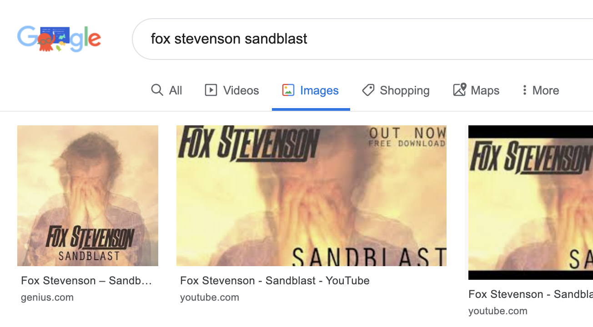
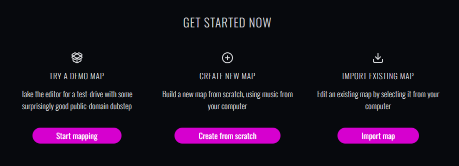
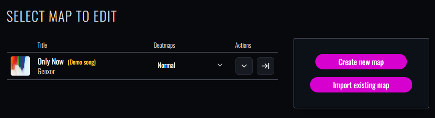
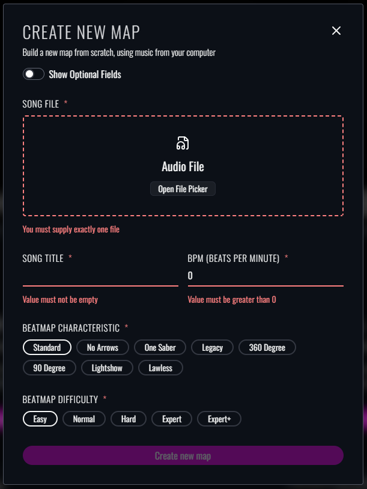

When you first visit [Beatmapper.app](https://beatmapper.app), you'll be presented with 3 options:

- Load a demo track
- Import an existing map
- Create a new map

For the quickest start, you can load the demo track, a short 1-minute edit of a public-domain dubstep track: [Only Now - Geoxor](https://soundcloud.com/geoxor/only-now). 

You can also import a map you've downloaded from [BeatSaver](https://beatsaver.com/) or created using another editor. 
Generally speaking, any map that is compatible with the most recent update of Beat Saber should be loadable and editable, 
although full support for modern beatmap features may not be available at this time. 

> You can check the [Compatibility Guide](/docs/migration#compatibility) for more information on which beatmap features may not have direct support within Beatmapper.

While these options are great for getting a quick look at the editor and playing around, you'll likely want to create your own map. 
From this point on, we'll assume you're creating a new map from scratch.

## File Prep

Before we can start mapping, we need to get our assets in order. Specifically, we'll need:

1. A square cover art image in `.jpg` or `.png` format
2. An audio file in `.ogg` format

### Song File

Beat Saber requires that all songs are in the OGG Vorbis (`.ogg`) audio format.

The [Basic Audio](https://bsmg.wiki/mapping/basic-audio) guide on the BSMG Wiki covers this process in greater depth than we will here. 
If you're new to mapping, I'd recommend reading that guide in full, and then coming back here armed with a song file and all the info we need.

### Cover Art File

For cover art, the image you select needs to be square. Any resolution should be fine as long as the aspect ratio is 1:1.

An easy way to tackle this step is to grab the song's official cover art from the "images" tab of your preferred search engine:

> [!important]
> Please note that no matter where you get your image from, you'll need to crop that photo to be a square. 
> You won't be able to upload or share your map if your cover art is rectangular.

## Creating a Map

To create your first map, select the middle option from the homepage:

If you've already loaded the demo track or imported an existing map, you can instead click the "Create new map" button in the right side-panel:

Either way, you'll be prompted with a modal that asks you for some of information:

You can drag-and-drop your files onto their respective dropzones to populate them, or click inside the dropzone to open the traditional file picker.

> [!tip]
> If you decide not to supply a cover image at this point in the creation process, a placeholder will automatically be supplied for you.
> You can always update the cover image after the fact once you get ready for publishing, so don't fret too much if you haven't picked one out yet.

From here, you'll be asked to fill out the minimal set of fields required to parse your map file and timings.

Other metadata fields are available via the "Show Optional Fields" toggle at the top of the form.
You can either fill them out now if you have the information on hand, or wait to fill them out once you're ready to publish.

Here's a quick breakdown of each of the available fields:

- **Song Title** / **Song Subtitle** / **Song Artist(s)**: The metadata associated with your song file. 
  Generally speaking, you can look up this information pretty easily if you acquired your audio from a distributor.
  
- **BPM**: Also known as beats-per-minute. Used to determine the timing and spacing between beats for your song.
  
> [!note]
> For more information on how to determine the correct timings for your map, please consult the BSMG Wiki's [Basic Audio](https://bsmg.wiki/mapping/basic-audio) guide.

- **Editor Offset**: If the silence you added to your map is not perfectly lined up with the first beat of your song, 
  you can modify this value to adjust the cosmetic offset, in milliseconds, for the start of your song.
  
> [!warning]
> The Editor Offset field does not create silence for you, and using a negative value has no effect on delaying the start of the song in-game.
> In order to properly prevent a hot start, you will need to add silence using a proper audio editing tool and consult the [Basic Audio](https://bsmg.wiki/mapping/basic-audio#plan-your-first-note) guide.

- **Preview Start Time** / **Preview Duration**: When browsing songs in-game, a short preview of the song is played. 
  These values let you control when the preview starts, in seconds, and how long the preview should run for.

- **Base Environment**: Environments control the lighting and events, the aesthetics of the space the game is played in.
  This specific setting is used when serializing your map to legacy map formats, as well as the template when generating color schemes and setting environment overrides for your beatmaps. 

> [!caution]
> The capability to enter custom values in Environment fields is specifically for maps that use newer environments to be compatible in-editor without breaking the app. 
> If you decide to enter an unsupported value in this field, **you will not be able to publish your map on BeatSaver**, 
> so we highly recommend waiting for unsupported environments to arrive in a future update before entering custom values for them.

In addition to song metadata, a **Characteristic** and **Difficulty** must be selected, which describes the behavior and difficulty level of your first beatmap. 
You'll be able to create whatever characteristics and difficulties you'd like beyond this point, so don't worry too much about this choice! 
You're only selecting the one you'd like to start with.

Once you submit this form, you'll be taken to the first "view" of the editor.

Follow the link below to jump to the next section of our guide, which will cover how to navigate the different views of the editor.
