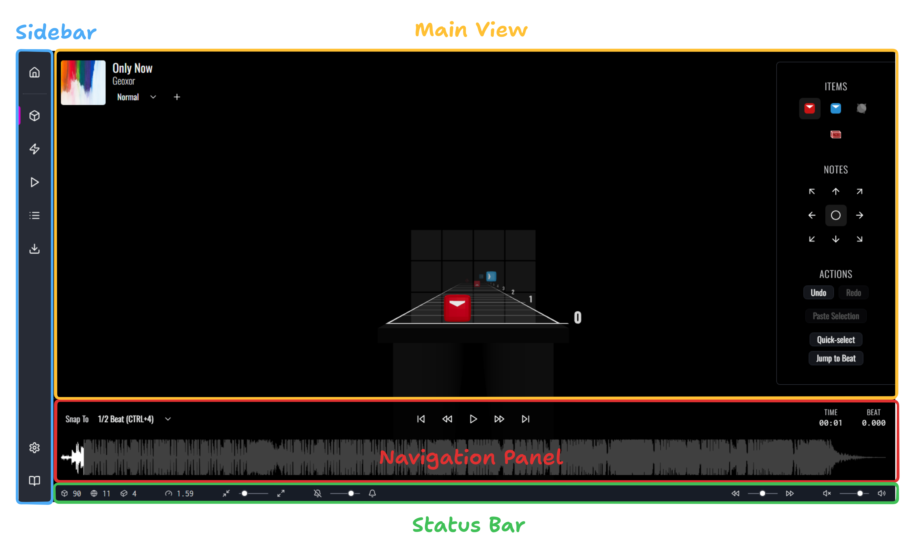
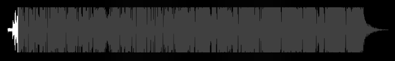
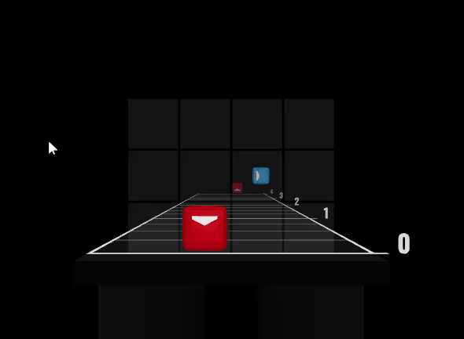
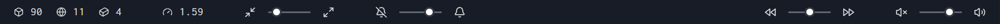
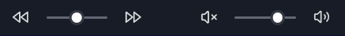
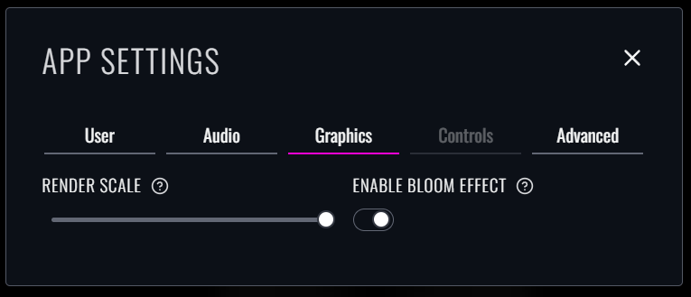

After either creating or importing your first map, you'll find yourself in the editor. Here's how it's laid out:

## Main View

The **main view** contains the content for the currently-selected tab. By default, we land on the "Beatmap" view. 
We'll learn much more about all the available views in this manual, but for now it's sufficient to understand that this is where you'll do your actual mapping.

## Navigation Panel

Below the main view, you'll find the **navigation panel**. It allows you to scrub forwards and backwards in time, trigger playback, and make customizations to navigation behavior.

### Navigating Time

There are many ways to move through time in the song:

#### Playback Controls

In the top-center of the navigation panel, you'll find buttons for playing / pausing the track (shortcut: <Shortcut>Space</Shortcut>), 
jumping forwards/backwards by 32 beats (<Shortcut separator="/">Page Up / Page Down</Shortcut>), and jumping straight to the beginning or end (<Shortcut separator="/">Home / End</Shortcut>).

#### Visualizer

At the bottom of the view, you'll see a visualization of the loaded audio file.

You can **click and drag** to scrub through the timeline, or simply click to set the current time to the corresponding point. 
This is probably the best way to quickly get to a specific area of the song.

#### Seeking

The most common way to navigate around is known as "seeking". Seeking works by moving the cursor forwards or backwards by a _specific number of beats_, which defaults to 1/2 beat.

You can **scroll the mousewheel** to seek - every tick up will send you forwards by _1 increment_, while mouse-wheeling in the opposite direction will seek backwards.

You can also use the arrow keys! <Shortcut>up</Shortcut> and <Shortcut>right</Shortcut> are used to go forwards, while <Shortcut>down</Shortcut> and <Shortcut>left</Shortcut> will go backward.

You can change the "snapping interval", which affects how far each tick takes you.

Clicking on the dropdown will show you all available options, as well as the corresponding keyboard shortcuts:

> You can also shift between snapping intervals by holding <Shortcut>META</Shortcut> and spinning the mousewheel.

### Navigating Space

By default, the camera will be facing the placement grid head-on. The main benefit of a 3D editor is the ability to move around, though!

You can move the camera by **holding <Shortcut>shift</Shortcut>** and **using <Shortcut>W+A+S+D</Shortcut>**, while looking around with the mouse, as you might in a first-person shooter video game. 
You can also use <Shortcut>R</Shortcut> to rise up, and <Shortcut>F</Shortcut> to fall down (while still holding shift).

At any point, you can press <Shortcut>backspace</Shortcut> to reset the camera's position to the default head-on view.

## Status Bar

Below the navigation panel, you'll find the **status bar**. It displays useful statistics about the current view and allows you to access view-specific controls.

The fields on the left-side reflect controls that are specific to that particular view, while the fields on the right are universal to all views:

- Starting from the left, the first slider controls the "playback rate", or the speed at which the audio should be played.
- The next slider controls the "volume" of the song, or how loud the audio playback should be. 

We'll explore the left-hand settings as we cover each respective view.

## Sidebar

The **Sidebar** contains links to the 5 current views: "Beatmap", "Lightshow", "Preview", "Details", and "Download". You can hop between views using these links.

Crucially, the sidebar contains two other links, located at the bottom:

- The "App Settings" dialog.
- A link to the documentation site, the same one you're reading from right now!

### App Settings

Click the little gear icon near the bottom of the sidebar. You should see a little popup in the middle of the window:

All settings for the editor are divided within the 5 available categories:

- **User**: for settings that pertain to you, the user! Generally used for customizations, like listing a "username" that can autofill the mappers/lighters fields when creating a new map.
- **Audio**: for everything audio-related, including customizing hitsounds and adjusting audio delay.
- **Graphics**: for the visual components of the editor, such as the render scale and post-processing effects.
- **Controls**: for everything related to hotkeys and user input (currently disabled since there's nothing to configure just yet).
- **Advanced**: for more advanced settings and experimental features. You probably won't need to mess with this stuff unless you *really* know what you're doing.

Here's a couple of useful settings you might want to know about if you're fresh:

- Bumping down the "Render Scale" slider may improve performance if you're using a lower-end machine, 
  since the setting will reduce the number of computationally-expensive objects (or dispatched updates) at once.
- The "Processing delay" field in the "Audio" tab lets you adjust the delay of the song audio in-editor, in case the hitsounds aren't properly synced up with the music.
  **This is not a means of syncing the audio for your map in-game**; this is purely to account for browser latency within the web editor.
