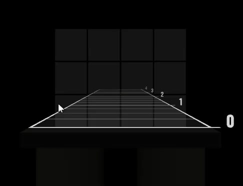

After loading a map, you'll be tossed into the **“Beatmap” view**. 
This view allows you to add _notes_, _mines_, and _obstacles_ to your map (AKA all the stuff you interact with in-game):

The main area is taken up by a 3D representation of the notes in your song. You'll see the **placement grid** in the center; 
these 12 squares represent the possible positions for notes and other elements.

## Placing Notes

**Notes** are the foundational building blocks of your map. You can slice them with your sabers in the corresponding direction to score points.

To place a note, click on the corresponding square in the _placement grid_:

Notes can be placed in 8 cardinal directions, as well as a directionless "face" note. 
Notes also come in two colors, corresponding to which saber they need to be struck with. You can select color and direction using the right sidebar:

You'll be changing color and direction quite a lot while mapping, so a number of conveniences are provided. First, you can use **keyboard shortcuts**:

- To switch between red and blue notes, you can press the <Shortcut>R</Shortcut> and <Shortcut>B</Shortcut> keys (or the <Shortcut>1</Shortcut> and <Shortcut>2</Shortcut> keys). 
  You can also press <Shortcut>tab</Shortcut> to move forward between tools (including bombs and obstacles, which we'll learn about shortly), 
  or <Shortcut>shift + tab</Shortcut> to move backwards between tools.
- To select a note direction, you can use the letters <Shortcut>w+a+s+d</Shortcut>. 
  For example, you'd press <Shortcut>w</Shortcut> to select an "up" direction note. For diagonals, you can hold multiple keys: to select a top-left note, press <Shortcut>w + a</Shortcut> at the same time.

You can swap the color of an existing note by clicking on it with the **middle mouse button**:

Finally, you can **click and drag** to dynamically select a note direction. This is my personal favourite way to place notes:

## Placing Bombs

Unlike notes, **bombs** are meant to be evasive objects, and will deplete your health when they collide with your sabers. 

A bomb doesn't have an associated color or direction, but otherwise they work just like notes.

You can select them from the right sidebar, or press <Shortcut>3</Shortcut> to select them. 
You can also cycle through tools with <Shortcut>tab</Shortcut> and <Shortcut>shift + tab</Shortcut>.

## Placing Obstacles

Obstacles are a bit different - they take up multiple cells at the same time, and come in two variants: **full-height** and **crouch** walls.

To place a full-height wall, click and drag across the _bottom 2 rows_ in the placement grid.

Crouch walls are placed the same way, but by clicking on the top row of squares. You can flip between ceilings and walls by moving the mouse up and down, before releasing:

> You'll notice that for full-height walls, you're limited to placing walls that are 1 or 2 columns wide, no wider. 
> This is a safety precaution; 3-column-thick walls can be hazardous, as folks try to leap out of the way. 
> If you really want to place a super-wide wall, you'll need to do it in another editor.

### Tweaking Duration

By default, obstacles will be **4 beats long**.

You can resize them after placing the obstacle by clicking and dragging to the left or right:

> This control respects the "snapping interval" selected in the bottom-left. If you wish to have more precision around obstacle duration, you can tweak this control.

You can also change obstacle duration by clicking to select it, and using the "Change duration" button in the side panel:

> When you change the duration of an obstacle, it sets the new default duration, so that the next new obstacle you create will be the same size. 
> This allows you to quickly place multiple obstacles of the same length.

## Bulk Editing

Sometimes, you'll want to perform bulk actions on a collection of notes/bombs/obstacles. 
You may wish to copy/paste a section of notes, or delete everything after a certain point, or swap a section horizontally or vertically.

Beatmapper's solution for this problem is called "selections". You can add items to the current selection by **left-clicking** them. Clicking again will _deselect_ the item.

As a convenience, you can also **click and hold** to select (or deselect) many items at once.

To **clear your selection**, press the <Shortcut>Escape</Shortcut> key on your keyboard. You can also toggle between selecting all notes and no notes with <Shortcut>meta + a</Shortcut>.

> Keep an eye on the right side-panel: It updates to reflect the current selection, and offers special actions that can be performed on the current selection.

To **delete selected items**, you can use the <Shortcut>Delete</Shortcut> key. Alternatively, you can also right-click items to delete them.

If you make a mistake deleting items, you can undo with <Shortcut>meta + z</Shortcut>.

You can **copy and paste** using the standard shortcuts for your operating system:

- <Shortcut>meta + c</Shortcut> to copy
- <Shortcut>meta + x</Shortcut> to cut (copies to the clipboard and deletes the notes)
- <Shortcut>meta + v</Shortcut> to paste

### Quick-Select

It can be tedious to drag your mouse over all notes in a given section. To make life easier, you can use the "Quick-select" button in the right side-panel (Keyboard shortcut <Shortcut>q</Shortcut>). 
This will prompt you to enter a _range of beats_ to select:

The value you enter must be in the form "start-end":

| Valid   | Invalid       |
| ------- | ------------- |
| 4-12    | 4 12          |
| 0-100   | 0 to 100      |
| 32-64   | 64-32         |
| 128-256 | 32-64 128-256 |

As a convenience, you can also enter a single number (eg. `64`) to select _everything starting from_ a given beat number.

> When you provide a range, it will _include_ any notes on the start beat, but _exclude_ any notes on the end beat. While this behaviour might be a bit confusing at first, it's **much** easier to work with, since it means you can copy/paste selections end-to-end without overlaps.

## Status Bar Controls

At the very bottom left of the screen, you'll find some numbers and controls for the "Beatmap" view:

> Note that these controls affect the editing experience only. They don't affect the map itself, so none of these controls will have any effect in-game.

- The stat indicators starting from the left of the status bar are for note count, bomb count, obstacle count, and notes-per-second respectively.
- The first slider controls the "beat depth", which controls the visual spacing between notes.
- The second slider controls the volume of the "note tick", or "hitsounds". 
  When the song is playing, a "tick" sound will play when the cursor overlaps with a note on the track, which should give you a better idea for the timings of your notes relative to the song.
  
> The tick sound may be slightly off-beat; I believe this is true for all editors, because having the audio and video perfectly synchronized is a devilishly hard challenge. 
> **It is not recommended for using the tick sound effect to calculate BPM or offset**; 
> The BSMG has an [extensive guide](https://bsmg.wiki/mapping/basic-audio#syncing-audio) covering how to accurately come up with BPM and offset. 
> The tick sound effect is designed with a single purpose in mind: to give you a sense of the rhythm of your notes, to make sure they align with key elements in the song.

## Next Steps

This guide has only scratched the surface of what you can do in Beatmapper! 
After you've had some practice with the editor, it is recommended that you check out the full list of [keyboard shortcuts](/docs/shortcuts) to learn the full suite of controls.

Next up, we'll be looking at the **"Lightshow" view**, to learn about creating a custom lightshow.
