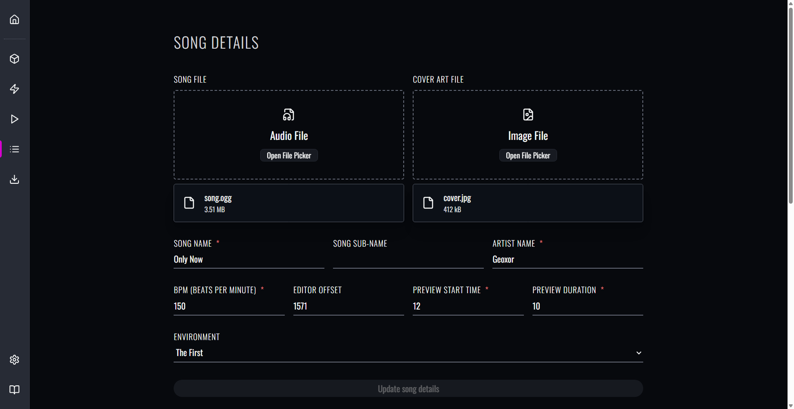
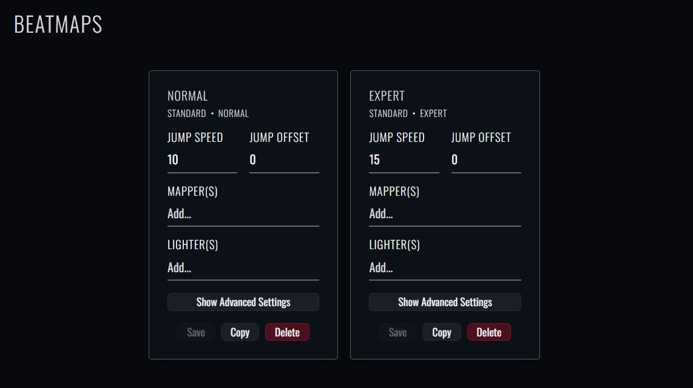
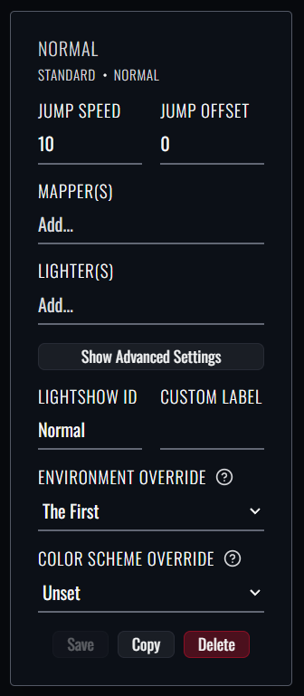
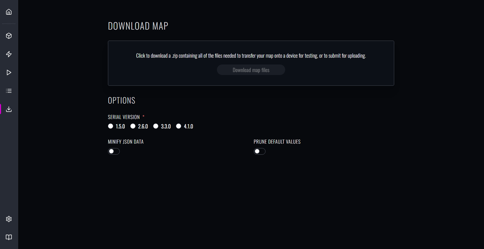

As you work on your map, you'll undoubtedly want to try your map out on your headset! And, once you're ready to share it with others, you'll want to publish it.

This section of the guide covers how to export from Beatmapper.

## Editing Info Metadata

While you added some basic details during the map creation process, there are some other things we'll want to set up before finishing up. 
Let's head over to the next tab in our left sidebar, the "Details" view:

When you created your map, you were asked for the minimal set of metadata required for the creation process. 
This view makes available the full suite of configurable metadata for your beatmap.

We'll cover the new settings that are now made available compared to before:

- **Preview Start Time** / **Preview Duration**: When browsing songs in-game, a short preview of the song is played. 
  These values let you control when the preview starts, in seconds, and how long the preview should run for.
- **Environment**: Environments control the lighting and events, the aesthetics of the space the game is played in.

## Editing Beatmap Metadata

If you scroll down, you'll find some additional settings for the beatmaps you've been working on:

- **Jump Speed**: This controls how fast blocks move towards the player. In general, higher difficulties feature higher values, so that the blocks aren't clustered too tightly together.
- **Jump Offset**: This is the number of beats that blocks spawn away from the player. Larger numbers make the blocks spawn further away, which can help with visibility.
- **Mappers/Lighters**: These are all of the users involved with the creation of the beatmap.

Some advanced settings for beatmaps are also available for users who want to play around with more sophisticated features:

- **Lightshow ID**: You may want to share the contents of your lightshow with another beatmap, as opposed to having to rebuild the same lightshow from scratch. 
  To do so, update this field to match the ID of the beatmap you'd like to share the contents with. 
- **Custom Label**: When SongCore is installed, this label will be displayed in lieu of the traditional label.
- **Environment Override**: This setting allows you to choose a unique environment for the specific beatmap, overriding the base environment you defined earlier.
- **Color Scheme Override**: This setting allows you to choose a unique color scheme for the specific beatmap, 
  overriding the color scheme derived from the beatmap's currently selected environment.

> Currently, there is not yet support for creating and modifying vanilla color schemes.

## Downloading Your Map

Finally, the last main tab in the left sidebar is the "Download" view.

Before you can download a map, you'll need to pick a **Serial Version** that your beatmap should be converted to in order to properly load your map into the game.
Each [map format](https://bsmg.wiki/mapping/map-format) is different in terms of the capabilities and featuresets they support, so pick the one that best fits your needs:

- **1.5.0**: The legacy map format. Generally not widely used anymore and officially deprecated by the base game as of recent updates, 
  but may be useful if you'd like to experience your map on a *super* old version of the game.
- **2.6.0**: The most widely-supported map format. Does not support more recent features like arcs/chains or event boxes, 
  but ensures the most compatibility with legacy editors or older versions of the game.
- **3.3.0**: The most popular map format. Supports just about everything within the modern featureset (minus really new features like NJS changes). 
  Recommended if you'd like to import your map into other community editors like ChroMapper.
- **4.1.0**: The most recent map format. Uses a unique compression format for optimization purposes and new info metadata fields. 
  Recommended if you'd like to import your map into the official level editor.

You can also customize some options for how your beatmap data should be processed when downloading your map from this view:

- **Minify JSON Data**: When enabled, this will remove all whitespace from the JSON data, which will give you a slight optimization in overall filesize.
- **Prune Default Values**: When enabled, this will remove any fields that the base game will automatically populate with a default value when left undefined.
  This is more commonly implemented within the official editor for optimization purposes.

Once you've picked a serial version, the large pink button will allow you to download a .zip archive of your map contents, in the selected format you've chosen.
You can also download your map at any time using <Shortcut>meta+s</Shortcut>. 

> **It's recommended that you save often**; while not super common, the browser may occasionally decide to empty out the locally-persisted data, which includes all your work on your maps!

The .zip file downloaded from Beatmapper is formatted to be compatible with the map format you selected, 
so you can use your newly-downloaded map the same way you can with any other editor.

From here, you can read through the following guides to learn how to try out your map in-game and publish your map to BeatSaver:

- [Beginner's Guide to Modding](https://bsmg.wiki/beginners-guide.html)
- [Playtesting Guide](https://bsmg.wiki/mapping/#playtesting)
- [Publishing Guide](https://bsmg.wiki/mapping/#publishing-songs)