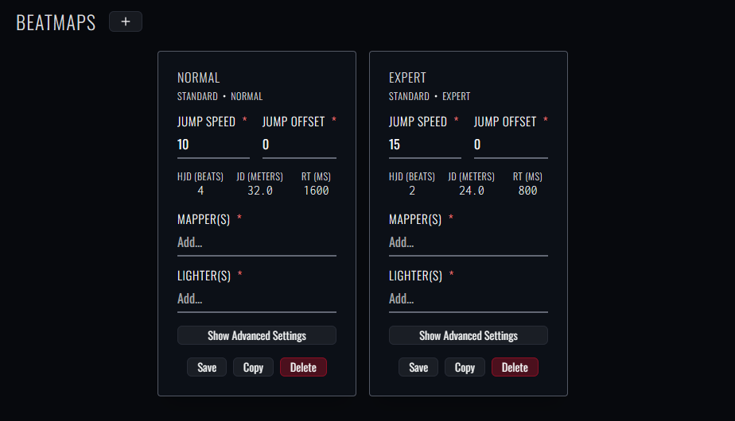
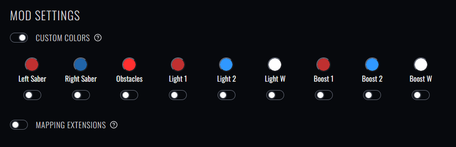
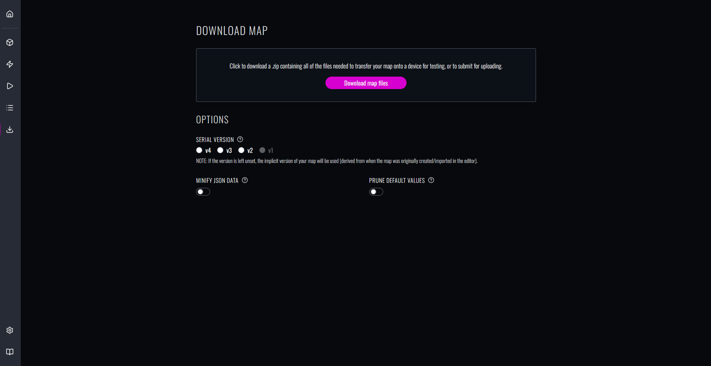

As you work on your map, you'll undoubtedly want to try your map out on your headset! And, once you're ready to share it with others, you'll want to publish it.

This section of the guide covers how to export from Beatmapper.

## Editing Info Metadata

While you added some basic details during the map creation process, there are some other things we'll want to set up before finishing up. 
Let's head over to the next tab in our left sidebar, the "Details" view:

When you created your map, you were asked for the minimal set of song metadata required for the creation process. 
This view makes available the full suite of configurable metadata for your mapset, 
where you can modify these values at your discretion if you're not happy with the current values set for those fields.

## Editing Beatmap Metadata

The **Beatmaps** section allows you to manage all of the beatmaps associated with your mapset.
You can also add new beatmaps from within this section by clicking the + button.

Every beatmap you created so far has an associated card. Within each card, you'll find some more specific metadata you can update for your beatmap:

- **Jump Speed**: This controls how fast blocks move towards the player. In general, higher difficulties feature higher values, so that the blocks aren't clustered too tightly together.
- **Jump Offset**: This is the number of beats that blocks spawn away from the player. Larger numbers make the blocks spawn further away, which can help with visibility.
- **Mappers/Lighters**: These are all of the users involved with the creation of the beatmap.

> [!tip]
> Below the Jump fields, you'll notice some stats that will give you the calculated measurements for the spawn distances of notes. 
> You can learn more about how to interpret these fields in the corresponding guide on the [BSMG Wiki](https://bsmg.wiki/mapping/basic-mapping.html#note-jump-speed)

Some advanced settings for beatmaps are also available for users who want to play around with more sophisticated features:

- **Lightshow**: You may want to share the contents of your lightshow with another beatmap, as opposed to having to rebuild the same lightshow from scratch. 
  To do so, update this field to match the identifier of the beatmap you'd like to share the contents with, or enter a custom value here to create a new lightshow. 
- **Custom Label**: When SongCore is installed, this label will be displayed in lieu of the traditional label.
- **Environment Override**: This setting allows you to choose a unique environment for the beatmap, overriding the base environment you defined earlier.
- **Color Scheme Override**: This setting allows you to choose a unique color scheme for the beatmap, overriding the color scheme derived from the beatmap's currently selected environment. 

## Editing Color Schemes

Sometimes, you may want to assign new color schemes to specific difficulties on an individual basis.
For that, let's move over to **Color Schemes**.

You can click on the + button to add a new color scheme to your mapset.
You'll need to enter a unique name, and from there it'll generate a new color scheme based on your active colors (or preset if you selected one).

> By default, the color scheme generated will reflect that of your base environment (or custom colors if they have been enabled and defined for the map).

To apply your color scheme to your beatmaps, simply hop back over to the "Beatmaps" tab. 
You'll see the name of your new color scheme available to select within the "Color Scheme Override" field.

> [!note]

To modify the color scheme, simply click on the swatch and enter in a new value within the pop-up modal. 
There's a variety of color formats available, including RGB, HSV, and HEX, as well as a color picker you can use to pluck a color from anywhere on your screen.

> [!warning]
> Any customization of the "white" light/boost colors for vanilla color schemes reflects modded behavior, 
> which **may not be fully compatible with the base game or official editor**.
> In order to make your color scheme vanilla compatible, you'll want to set both "white" color values to #FFFFFF.

Some additional toggles are available below the swatches to conditionally enable/disable overrides for the color scheme, 
where these overrides will apply to those beatmaps that adopt the color scheme.

## Mod Settings

The final tab contains some additional settings you can enable for your beatmaps specifically powered by mods you can install for your base-game. 
While these settings open up new capabilities for the editor, **they are not guarateed to have full compatibility with the base game**. 

You can learn more about how these advanced settings work and what they enable in the [Mods](/docs/mods) page.

## Downloading Your Map

Finally, the last main tab in the left sidebar is the "Download" view.

Before you can download a map, you'll need to pick a **Serial Version** that your beatmap should be converted to in order to properly load your map into the game.
Each [map format](https://bsmg.wiki/mapping/map-format) is different in terms of the capabilities and featuresets they support, so pick the one that best fits your needs:

- **v4** (4.1.0): The most recent map format. Uses a unique compression format for optimization purposes and new info metadata fields. 
  Recommended if you'd like to import your map into the official level editor.
- **v3** (3.3.0): The most popular map format. Supports just about everything within the modern featureset (minus really new features like NJS changes). 
  Recommended if you'd like to import your map into other community editors like ChroMapper.
- **v2** (2.6.0): The most widely-supported map format. Does not support more recent features like arcs/chains or event boxes, 
  but ensures the most compatibility with legacy editors or older versions of the game.

You can also customize some options for how your beatmap data should be processed when downloading your map from this view:

- **Minify JSON Data**: When enabled, this will remove all whitespace from the JSON data, which will give you a slight optimization in overall filesize.
- **Prune Default Values**: When enabled, this will remove any fields that the base game will automatically populate with a default value when left undefined.
  This is more commonly implemented within the official editor for optimization purposes.

Once you've picked a serial version, the large pink button will allow you to download a .zip archive of your map contents, in the selected format you've chosen.
You can also download your map at any time using <Shortcut>meta+p</Shortcut>. 

> [!warning]
> **It's recommended that you save often**. 
> While not super common, the browser may occasionally decide to empty out the locally-persisted data, which includes all your work on your maps!

The .zip file downloaded from Beatmapper is formatted to be compatible with the map format you selected, 
so you can use your newly-downloaded map the same way you can with any other editor.

From here, you can read through the following guides to learn how to try out your map in-game and publish your map to BeatSaver:

- [Beginner's Guide to Modding](https://bsmg.wiki/beginners-guide.html)
- [Playtesting Guide](https://bsmg.wiki/mapping/#playtesting)
- [Publishing Guide](https://bsmg.wiki/mapping/#publishing-songs)