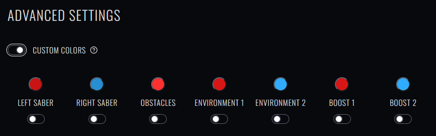
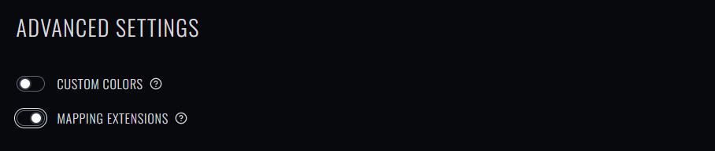
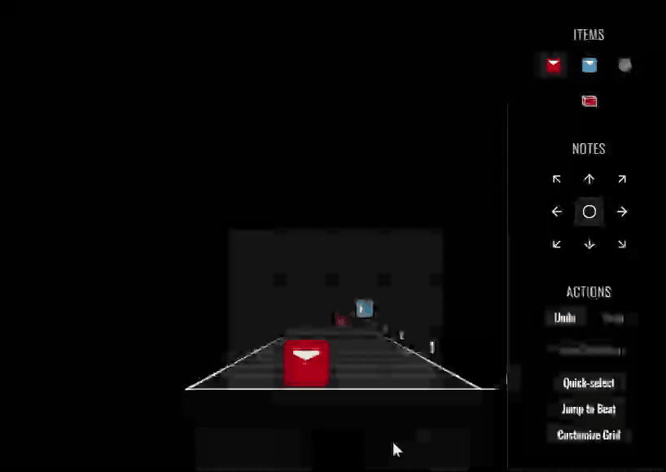
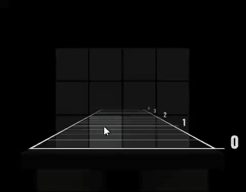

There are a lot of really cool mods for Beat Saber, and Beatmapper offers limited support for certain modded features.

## Custom Color Overrides

The [SongCore](https://github.com/Kylemc1413/SongCore) mod allows maps to customize the color scheme for a beatmap independently of the map format.

In Beatmapper, you can enable these overrides in the "Advaced Settings" tab by enabling the "Custom Colors" toggle:

Unlike traditional color scheme overrides, these custom color overrides will apply *universally* to all beatmaps, 
and each override can be individually enabled or disabled by clicking the toggle below the color swatch.

> For users who haven't installed the SongCore mod, your map will still load and be playable, it just won't respect the custom colors you've assigned.

## Mapping Extensions

The [Mapping Extensions](https://github.com/Kylemc1413/MappingExtensions) mod grants incredible power to the modder:

- Notes can be added anywhere, not just in the 12 traditional spots
- Obstacles can come in any shape and size, not just wall/ceiling
- Blocks can take on 360 degrees of directions, not just the cardinal and diagonal directions.

To use Mapping Extensions, first you have to enable it for your map in the "Map Settings" tab:

> Note: Ticking this box will mean that only users who have Mapping Extensions enabled will be able to play your map. Some users will not be able to play your map if you tick this box.

### Custom Grids

Beatmapper approaches precision placement in a bit of an unconventional way. 
Rather than simply letting you place notes outside the 4×3 grid, it allows you to _redefine the grid_. 
Maybe you want a section of the song to be in a 5×4 grid, or maybe you want to squeeze an extra column in between all the normal ones, for a 7×3 grid in the space of a 4×3 one.

Once Mapping Extensions has been enabled for your map, a new button appears in the "Beatmap" view's right-hand sidebar: `Customize Grid`.

Clicking this button swaps the side-panel to one that allows you to customize the number of rows and columns in the grid. 
You can also change the width and height of each cell, so that a larger number of columns doesn't need to take up more physical space in the world!

> Changing the grid doesn't affect notes you've already placed. This means that different sections of your map can use different grids! 

You can also click the "Save Preset" button to save your custom grid as a "preset". By doing so, you'll be able to load your grid preset at any time while Mapping Extensions is enabled!

### Precision Rotation

With Mapping Extensions enabled, you aren't constrained to 8 possible directions. Hold <Shortcut>meta</Shortcut> when dragging a cell to allow for 360-degree placement:

