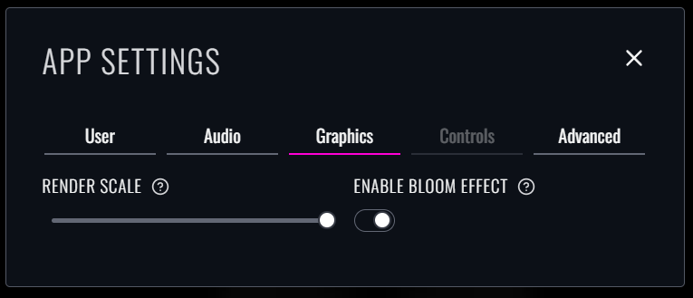

After more than half a year's worth of maintenance work, the rewrite is finally complete, and the next update to Beatmapper is now live for all users!

While there's not too many user-facing changes in this update, 
a lot of work was done behind the scenes to revitalize the 4-year-old codebase with modern dependencies and production-grade architecture.
The end result of this update is effectively a foundation for more rapid and active development going forward, along with a healthy share of performance and stability improvements.

As per usual, if you encounter any bugs or issues with this update, be sure to drop a new issue on the [repository](https://github.com/bsmg/beatmapper) 
so that we can slate any bugfixes for an upcoming patch release.

## New Serialization Layer

As of this update, **every** map format supported by the base game is now supported within the editor, including the newly-introduced v3 and v4 map formats.

We're architecting our new serialization layer around Kival Evan's [`bsmap`](https://github.com/KivalEvan/BeatSaber-JSMap) engine, 
which offers many useful helpers and utilities for parsing beatmap data across all map formats
(and is also predominately used in other web-based converters and scripting engines like ReMapper). 

Its recent `2.2` update integrated many changes that allow us to effectively mount the editor's serialization logic directly on top of the engine, 
thanks to some new primitives, upgraded schemas, and some new helper functions that were ported over from our old serialization logic.
These changes allow us to **finally** offer direct support for newer map formats more easily and quickly compared to before, 
and guarantees that any future updates won't cause major incompatibilities.

Here's a quick rundown of how this new serialziation layer works under the hood:

- You can freely import/export maps of *any* supported beatmap format, including v1, v2, v3, and v4. 
- All serial data stored within Beatmapper is using a custom wrapper, which allows all supported fields to be present and operable regardless of which version was first imported.
- When new updates or breaking changes to the map format are introduced, these updates *won't* retroactively break any locally stored map data.
- Any unsupported metadata contained in your map files (any metadata fields that are not supported within Beatmapper) *will be preserved* when importing a pre-existing map into Beatmapper. 
  - The only exceptions to this are for collections that directly impact gameplay, such as arcs/chains and NJS events, 
    since those elements being uninteractable may or may not cause issues when loading these changes in-game.

While we may not have any robust support for newer beatmap features quite yet, this is the first real step in laying the groundwork for these features to be properly integrated, 
and opens the door for a much wider pool of maps to finally be somewhat compatible with the web editor.

### Lightshow Changes

In the previous version of Beatmapper, all beatmaps would share the same lightshow by default, regardless of what was previously imported into the editor.
This was nice for quality-of-life in not having to port over your lightshow for each individual beatmap, 
but it unfortunately removed a very useful capability to have unique lightshows for each difficulty, 
along with no way of allowing for these behaviors to be controlled by the user.

This update addresses both of these use cases by allowing you to individually specify a "Lightshow ID" for each beatmap, 
and this new field will alter the behavior in how lighting events are processed.

You can read more about these changes in the [migration guide](/docs/migration#sharable-lightshow-contents).

### New Metadata Fields

Lots of new info metadata fields that were introduced alongside the v3 and v4 map format updates have been integrated into the editor.
While support is still limited in some areas, we did manage to crack a couple long-requested additions that should make Beatmapper more compatible with a much wider series of features:

- You can now specify the Characteristic of your beatmap, rather than being limited to just "Standard". 
  A subset of supported characteristics will be available when creating a new beatmap or copying an existing one.
- Per-difficulty environment overrides are fully supported, and will alter the color scheme for beatmap objects accordingly.
- Per-difficulty color schemes have rudimentary support. 
  While you can't add or edit any color schemes you defined, it will still parse them internally and allow you to re-assign them for each beatmap.
- You can now specify individual mapper and lighter credits, just like you can with the official editor.

Additionally, workflows for modern proprerties related to beatmap object serialization have also been introduced in this update:

- The angle offset property for notes is now supported in-editor. 
  To modify this property, you can hover over a note and <Shortcut>option</Shortcut> + scroll to alter the angle offset in 15-degree increments.
- The "free/unbounded" obstacle type introduced in v3 and onward now has visual support in-editor, 
  although the bounds of newly-created obstacles will still be constrained to full-height and crouch walls until improved support lands in a future update.
- You can now quick-edit obstacle duration by using <Shortcut>option</Shortcut> + scroll while hovering over an obstacle, which replaces the old janky drag controls from before.
- Enabling Mapping Extensions will use the mod's coordinate system for serializable object properties, rather than mixing them in with vanilla values.
- Basic light events now support float value serialization. 
  - The brightness value will be calculated based on the height from where you click, and will be fixed to the range of 0-1 by default. 
  - You can also hover over an event and <Shortcut>option</Shortcut> + scroll to alter the brightness value in increments of 0.125, including values that extend beyond the upper limit.
- Basic value events now share the same underlying architecture as other event types.
  - Thanks to this, the new <Shortcut>option</Shortcut> + scroll behavior for light events has been applied retroactively to value events, allowing you to finally set values beyond the upper limit of 8.
- Light "transition" events will no longer break the editor state and will now be properly displayed in the lighting editor. 
  However, support is still pretty limited, as the visual behavior will reflect that of the "on" effect, and you won't be able to create new transition events just yet.

## UI Refresh

The entire style system of the application has been given a fresh coat of paint, rewritten from the ground up for better reusability and composition.

- All design tokens (colors, spacing units, patterns, etc.) are now unified across the application. 
  No more instances of one component using 7 unique color values.
- Many core UI elements have been rewritten using compositions for better organization and accessibility practices. 
  No more cursed "spacer" elements flooding the page with `img` tags.
- The style system has been rearchitected to use atomic CSS classes and more responsive layouts. 
  Expect some tiny performance improvements thanks to fewer instances of chaotic runtime style injections. 
- Many pages now have a proper responsive layout on mobile devices and smaller screen sizes, 
  and will no longer result in the ["software gore"](https://www.reddit.com/r/softwaregore/comments/1aw5zmq/hey_do_you_prefer_light_mode_or_dark_mode_i/) of prior updates:

While some parts of the app may look and feel a tiny bit different than you remember, 
we did our best to keep the spirit the original design system, but modernized with newer CSS features and primitives.

Also, the docs site has a snazzy new dark theme. Your eyeballs will probably appreciate it.

## Technical Changes

As this update is slated as a "rewrite", there are TONS of technical changes and refactored systems in this update.
I'd say a solid 60-70% of the initial codebase has been rewritten in some capacity. 

We won't go too in-depth on the internal changes here, 
since many of these changes are already documented in extensive detail within the many [PRs](https://github.com/bsmg/beatmapper/pulls?q=is%3Apr+is%3Aclosed+milestone%3A0.4.0) 
made within the last 6 months or so. We'll just list off some of the highlights:

### Storage Engine Improvements

The application has a brand new storage layer, which should help mitigate the performance impact of frequent updates to persistable state.

- Many parts of state (which were previously packed into a monolithic JSON object in IndexedDB) have now been relocated to local/session storage.
- The storage middleware now acts on a series of observables, where state updates will only change when the targeted state values have changed. 
  This makes state updates more lightweight and allows us to create as many breaking changes to state as we want without breaking any storage behaviors.
- Migrations are now officially supported for the remaining IndexedDB stores, 
  which means we can now make breaking changes to object storage (like songs and grid presets) without you needing to backup your files and/or nuke your browser data.

### New Technologies

Many new frameworks and technologies were introduced to replace outdated dependencies and straight-up deprecated frameworks:

- [TanStack Router](https://tanstack.com/router/latest) has been integrated as the de-facto SPA routing solution, 
  alongside [other](https://tanstack.com/table/latest) [related](https://tanstack.com/form/latest) [libraries](https://tanstack.com/pacer/latest).
- [Ark UI](https://ark-ui.com/docs/overview/introduction) and [Panda CSS](https://panda-css.com/docs/overview/getting-started) makes up the core of our design system, 
  offering better compositions for complex component behaviors.
- A dedicated content collection system is now used to supply all content for the docs site, powered by [Velite](https://velite.js.org/).

### PWA Improvements

The initial integration of Vite's third-party PWA plugin was put together pretty hastily for the patch update, 
and there were some blatant oversights that weren't exactly fleshed out to make installation or offline compatibility work as intended on modern browsers.
These oversights have now been addressed thanks to some new changes to the project configuration:

- The manifest has been updated according to new baselines, supporting maskable icons and additional metadata.
- You will receive an in-app notification when offline mode is ready.
- You will now be explicitly prompted to "opt-in" to future updates to the editor, as opposed to auto-updating.
- All fonts are now bundled within the application directly for offline support via Fontsource, rather than being remotely fetched.

Admittedly, these improvements likely need some more public dogfooding before they're in a good state, but the 

## Quality of Life

In the process of "cleaning house" with this new update, we've also made some other general improvements to the editor from the initial "lull" period that are worth including. 
Let's blitz through them:

### New Settings Menu

The "Settings" dialog is now broken up into distinct tabs to better organize the existing settings and make room for new categories. 

- Many "hidden" settings that were automatically set in the background but were never accessible to the user are now directly editable, 
  such as the "username" value used to autocomplete the mapper field
- The "Audio" tab now has a new dropdown for selecting a hitsound from two available options.
- The former "Graphics Quality" setting is now broken up into two dedicated controls for "Render Scale" and "Enable Bloom Effect".
- A new "Advanced" tab is available, for users who know what they're doing and want more sophisticated control.

### Visualization Updates  

- Full-height obstacles have smarter placement controls, where it is now virtually impossible to place a 3-wide wall. Who needs the mapping wiki when you can just fix the problem in the first place!
- The color scheme for a beatmap is now visually represented, and will derive the correct values from the base environment scheme, 
  the beatmap's environment override, the beatmap's vanilla color scheme overrides, and the beatmap's custom color overrides respectively.
- The "Preview" tab now displays the full map visualization, which now include notes and obstacles, along with simulated Note Jump Speed and Start Beat Offset values.

### Notable Bug Fixes

- The loading flow of the editor will now be processed server-side before user input is accepted, which prevents the user input from being hardlocked. 
- Beatmapper will no longer panic when it tries to render the waveform for an audio file that has a short duration.
- The "Beat" indicator on the Navigation Panel is now accurately calculated, where the value no longer jumps from -1 to 0.
- The visual models for notes and bombs are now preloaded by default, and will no longer randomly disappear.
- The "drag direction" control has been reworked to provide proper closures for the emitted events (this means "tentative" notes will properly remove themselves when the pointer is up).
- The "join" behavior of the event selection box is now user-controllable by holding down the <Shortcut>meta</Shortcut> key, alongside other closures.
- When the "bloom" effect is disabled, any light materials will now be tinted with their respective color to improve visibility.
  ([#7](https://github.com/bsmg/beatmapper/issues/7))

## Breaking Changes

- The "overdrive" value for color schemes has been removed. 
  The base game never really properly supported this feature in the first place, and I don't think this is widely used enough to warrant its inclusion moving forward.
- The "Fast Walls" toggle has been removed, as the property was removed when moving to the new beatmap wrappers. 
  However, you can still create a fast wall by selecting an obstacle and setting the duration to a negative value manually if you so desire.
- Certain non-vanilla behaviors, such as fast walls and Mapping Extensions support, will not be 1-to-1 with base game visualization due to some upstream serialziation issues.

## Wrap-Up

With these changes in place, development should start moving more quickly again, so rest assured you won't have to wait another 4 years for 0.5 😅. 

Thank you for being patient with me throughout the process of getting this editor back up to speed. 
It took a lot of careful planning and research to make sure this gigantic update was handled correctly, and I'm happy to say the grunt work is now officially finished. 
We can finally start working on actual new features and improvements you've been patiently waiting for.

Before we wrap up, I'd like to drop some additional thanks to some individuals who indirectly helped get this editor back into shape:

- To Kival Evan, for helping me land many changes to the `bsmap` engine that made the implementation of the new serialization engine significantly easier to manage.
- To Caeden, Bloodcloak, and other BSMG staff, for allowing me to take the reins of this project into a new direction and spearhead this rewrite.
- To any users who DM'd me bug reports within the last few months or were courteous enough to drop a courtesy ping. 
  Happy to say that nearly all of the reports over the past few months are finally addressed in this update, .
- To you, for reading through this wall of text and may end up actually using this editor again. 
  It's honestly sick to be able to bring this project back to life, and I'm glad to know that people appreciate the work that went into it. 

That's all for now. Thank you all for your patience over the past few months, and enjoy the new update! ❤️