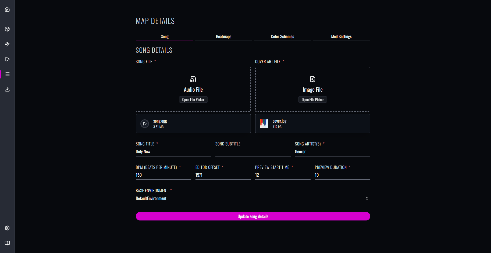
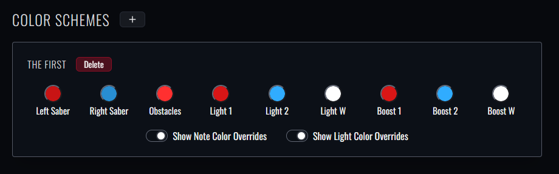

Okay I might have unintentionally lied about the "rapid updates" from our last changelog. 🫠
Nevertheless, we're back from hiatus and ready to deliver a brand new feature update to Beatmapper!

While the bulk of this update primarily consists of maintenance work to clean up some of the mess from the initial rewrite, 
I did manage to roll in a **ton** of quality-of-life improvements since last time, alongside a couple new features you probably weren't expecting.
Let's cover some of the highlights:

## Standalone Map Converter

A dedicated [map conversion tool](/convert) is now built directly into Beatmapper.

The converter uses the same serialization layer that's used across the editor and within the Download page, but fully decoupled from the internal filestore. 
This means that unlike the editor, *the standalone converter will not perform any special processing to your map files beyond what's necessary for compatibility*.

I originally rolled this as an internal tool to test some end-to-end behaviors of our packaging workflow,
but I figured it may be just as useful for those of you looking for a more robust conversion tool without having to fumble with scripts or load the maps into the editor every time.

## Free Obstacle Placement

Beat Saber's 1.41 update finally introduced unbounded obstacle placements into the editor workflow, where obstacle placements can now extend beyond simple full-height and crouch-height variants.

If you were paying close attention to the release notes for our 0.4 update from awhile back, 
you might have already noticed that visualization for free obstacles was already integrated within Beatmapper 
(minus legacy conversions we had to patch into the serialization engine for this update cycle).

When it came time to add support for free obstacle placement, there was some level of divergence in how other editors would approach support for this feature, 
and each strategy had their fair share of benefits and drawbacks.

1. The official editor's "modern" approach: restrict placement to the standard 4×3 grid. Nice for consistency, but you lose granularity for more specific units.
2. ChroMapper's "visual" approach: resize the placement grid to the visual bounds of the obstacle. Perfect for accuracy, but not the most aesthetic or intuitive workflow.

After trying both strategies to see how they would fare, I couldn't decide which approach would be best suited for Beatmapper, 
so I ended up integrating both workflows into this update:

If you'd like to learn more about how the new placement modes work in practice, check out the [updated section](/docs/manual/notes#obstacle-placement-modes) in the user manual.

## Improvements for Event Tracks 

We've finally rounded out support for event tracks in this update, along with the introduction of Color Boost events.

Not only do these events have robust support in-editor, but we've also fleshed out the general accuracy of their effects:

- Color boost events will automatically update the visual color of basic lighting events in-editor and within the preview according to whether the color boost effect is active.
- Basic transition events will now have proper interpolation of light color and brightness for their produced effects in both background boxes and previews.

And that's not all! We also landed a new feature to enable/disable the visibility of event tracks, 
which may be useful for improving performance and visual clarity for environments that support a large number of basic tracks.

## Updated Details View

The Details view has been given a bit of a facelift to break off its sections into dedicated tabs.
This new layout allows for a much nicer presentation, where dynamic elements won't shift the layout as drastically as before,
but also makes it easier for us to update the page with new features and capabilities:

And speaking of new features: [vanilla color scheme overrides](/docs/manual/publishing#editing-color-schemes) now have proper support in editor, meaning you can add, remove, and modify them at will:

It has all the same capabilities you would expect, like color pickers and conditional overrides, 
as well as a *unique* capability for pre-populating new color schemes based on your active colors or "presets" from those found in OST/DLC maps.

## Noteworthy Changes

I'm happy to report that lots of bugs and unintuitive behaviors were fixed within this release, so much so that I couldn't really keep track of absolutely everything that was changed.
Here's a quick rundown of the most important ones that you'll definitely want to keep an eye on:

- Vanilla BPM changes will now be reflected in the timescaling of audio playback and effects: 
  - Unfortunately no support for custom/legacy BPM changes quite yet; you can read the [compatibility guide](/docs/migration#compatibility) for more details.
- Beat markers now dynamically adjust their spacing based on your snap value, which should make it easier to see where the cursor will jump to at a glance.
- The difficulty switcher now preserves the current beat and playback state, which should hopefully make it more convenient to compare beatmap contents across difficulties without interruption.
- Inline rotations for color notes are now accurately reflected in the Preview view, meaning patterns like stacks and windows will be more visually accurate to how they will behave in-game.
- The Preview view will now simulate normalized jump behavior based on your set parameters and timescale changes. 
- The "Create Map" form was updated to hide all optional fields under an explicit toggle. 
  That way, you can move through the field more quickly using recommended fallbacks if you decide to hold off on updating these fields until you're ready to publish.
- The file upload components have been given better handling behavior for uploaded files:
  - All image and audio files will now feature an embedded preview for their contents.
  - Song files will let you preview audio based on the values you set for the "Song Preview" fields.
  - Cover image files will automatically crop to a square aspect ratio.
- The Mapping Extensions toggle will now allow you to customize the horizontal and vertical offset for the placement grid.

## Wrap-Up

I know it's been a hot minute since our last update; for what it's worth,
I originally planned on dropping a new patch update towards the end of last year to roll in some of these changes more gradually, 
but I ended up adding so many things over that period that the sheer amount of changes warranted graduating this release to a minor. 😵‍💫 

I'd like to say that future updates are most likely going to be more focused updates that won't result in the same degree of downtime, 
but the nature of an open source project governed by a single maintainer is that some updates may take considerably longer to roll out depending on their featureset and general availability. 

As a reminder, Beatmapper is entirely [open source](https://github.com/bsmg/beatmapper), 
and the burden of responsibility for shipping new improvements to the editor is not just limited to active maintainers. 
If you're interested in helping us get through our backlog of features and/or want to land your own changes to improve the editor, 
read through our [contributor's guide](https://github.com/bsmg/beatmapper/blob/master/CONTRIBUTING.md) and/or let us know if you have any questions.

That's all we got for now! If you run into any issues with the new update, be sure to [file a bug report](https://github.com/bsmg/beatmapper/issues) on the repository.
Otherwise, have fun with the new update! ✌️