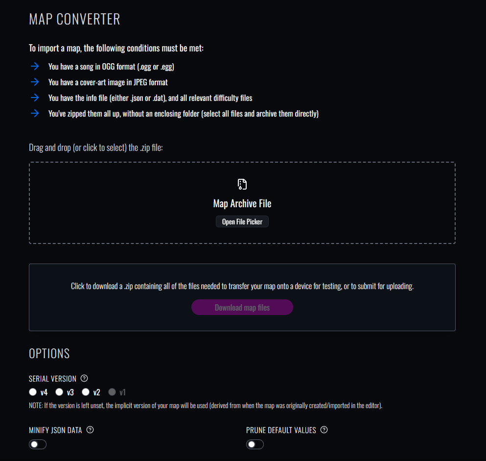
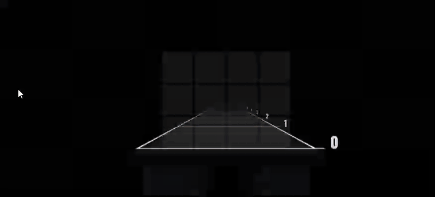
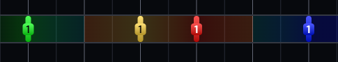
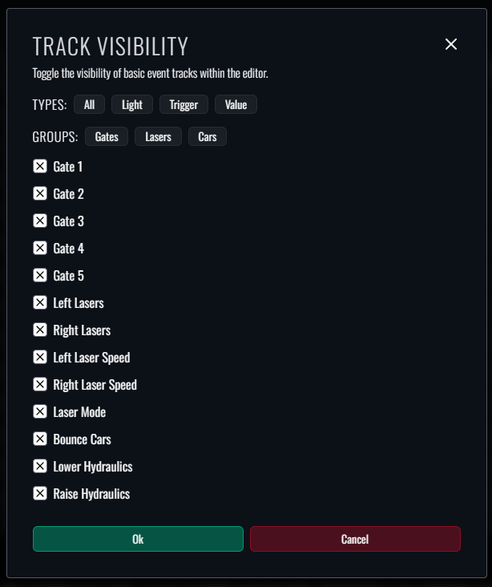

Okay I might have unintentionally lied about the "rapid updates" from our last changelog. 🫠
Nevertheless, we're back from hiatus and ready to deliver a brand new feature update to Beatmapper!

While the bulk of this update primarily consists of maintenance work to clean up some of the mess from the initial rewrite, 
I did manage to roll in a **ton** of feature parity and quality-of-life improvements you may or may not have been anticipating.
Let's cover some of the highlights:

## Standalone Map Converter

A dedicated [map conversion tool](/convert) is now built directly into Beatmapper:

The converter uses the same serialization layer that's used across the editor and within the Download page, but fully decoupled from the internal filestore. 
This means that unlike the editor, *the standalone converter will not perform any special processing to your map files*.

I originally rolled this as an internal tool to test some end-to-end behaviors of our packaging workflow,
but I figured it may be just as useful for those of you looking for a more robust conversion tool without having to fumble with scripts or load the maps into the editor every time.

## Free Obstacle Placement

Beat Saber's 1.41 update finally introduced unbounded obstacle placements into the editor workflow, where obstacle placements can now extend beyond simple full-height and crouch-height variants.

If you were paying close attention to the release notes for our 0.4 update from awhile back, 
you might have already noticed that visualization for free obstacles was already integrated within Beatmapper 
(minus the lack of support for v3 format and legacy conversions we had to patch into the serialization engine for this update cycle).

When it came time to add support for free obstacle placement, there was some level of divergence in how other editors would approach support for this feature, 
and each strategy had their fair share of benefits and drawbacks.

1. The official editor's "modern" approach: restrict placement to the standard 4×3 grid. Nice for consistency, but you lose granularity for more specific units.
2. ChroMapper's "visual" approach: resize the placement grid to the visual bounds of the obstacle. Perfect for accuracy, but not the most aesthetic or intuitive workflow.

After trying both strategies to see how they would fare, I couldn't decide which approach would be best suited for Beatmapper, 
so I ended up integrating both workflows into this update:

If you'd like to learn more about how the new placement modes work in practice, check out the [updated section](/docs/manual/notes#obstacle-placement-modes) in the user manual.

## Improvements for Event Tracks 

We've finally rounded out support for event tracks in this update, along with the introduction of Color Boost events.

Not only do these events have robust support in-editor, but we've also fleshed out the general accuracy of their effects:

- Color boost events will automatically update the visual color of basic lighting events in-editor and within the preview according to whether the color boost effect is active.
- Basic transition events will now have proper interpolation of light color and brightness for their produced effects in both background boxes and previews.

And that's not all! We also landed a new feature to enable/disable the visibility of event tracks, 
which may be useful for improving performance and visual clarity for environments that support a large number of basic tracks.

## Noteworthy Changes

I'm happy to report that lots of bugs and unintuitive behaviors were fixed within this release, so much so that I couldn't really keep track of absolutely everything that was changed.
Here's a quick rundown of the most important ones that you'll definitely want to keep an eye on:

- Beat markers now dynamically adjust their spacing based on your snap value, which should make it easier to see where the cursor will jump to at a glance.
- The difficulty switcher now preserves the current beat and playback state, which should hopefully make it more convenient to compare beatmap contents across difficulties without interruption.
- Inline rotations for color notes are now accurately reflected in the Preview view, meaning patterns like stacks and windows will be more visually accurate to how they will behave in-game.
- Vanilla color scheme overrides now have proper support in editor, meaning you can add, remove, and modify them at will!
- The "Create Map" form was updated to hide all optional fields under an explicit toggle. 
  That way, you can move through the field more quickly using recommended fallbacks if you decide to hold off on updating these fields until you're ready to publish.
- The file upload components now show previews for both the song and cover art file, where the former will let you preview the audio based on the values you set for the "Song Preview" fields.
- The Mapping Extensions setting will now allow you to customize the horizontal and vertical offset for the placement grid.

## Conclusion

I know it's been a hot minute since our last update; 
I did originally anticipate dropping a new patch update towards the end of last year to roll in some of these improvements more gradually, 
but what I didn't anticipate was the scope of these improvements being large enough to warrant graduating the next release to a minor. 😵‍💫 

The nature of an open source project governed by a single maintainer is that some updates will unfortunately take considerably longer than others, 
but rest assured: I do plan on continuing to release regular updates to Beatmapper so long as there are new improvements to be made. 
And we still have a very large backlog of other features that will give you lots to look forward to.

As a reminder, Beatmapper is also entirely open source and contributors with the technical expertise are welcome to submit PRs for any useful improvements they deem fit. 
If you're interested in helping get through the backlog of features on our roadmap and/or need help onboarding onto the codebase, 
you can reach out to [officialMECH](https://github.com/officialmech) and I'll be happy to get you up to speed.

Finally, if you run into any issues with the new update, be sure to [file a bug report on the repository](https://github.com/bsmg/beatmapper/issues). 
Until then, enjoy the update! ✌️