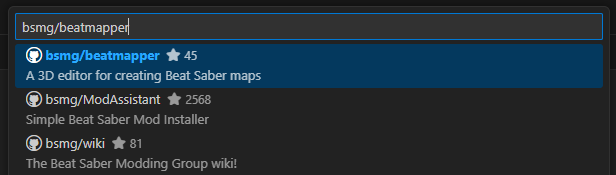

Beatmapper is open-source, meaning that its source code is made freely available for anyone to read and use. 
While you can't do _anything_ you want with it (it's [licensed under the MIT license](https://github.com/bsmg/beatmapper/blob/master/LICENSE.md)), 
you are definitely free to create your own local copy and modify it for your personal, non-commercial endeavors.

Here are some reasons you might wish to do this:

- You can make small tweaks, like adding your own new features or removing flows you don't need
- If the Beatmapper server goes down, your local copy will always work
- You can preview upcoming features before they're publically released  

> [!important]
> While this document doesn't assume any programming know-how, this is still a pretty technical thing to be doing. 
> The online version should work plenty well for most folks!

---

## Prerequisites

First thing's first, you'll need to [download and install Node.js](https://nodejs.org/en/). We'd recommend installing the LTS version for the greatest assurance of compatibility.

Node.js is a Javascript server environment, which is needed to compile the Beatmapper application.

> [!note]
> During installation on Windows, you'll be asked a number of questions in the install wizard. The default options are all sufficient.

We'll also be using an IDE (integrated development environment) to make the process of bootstrapping the project more manageable, especially if you consider yourself non-technical.

[Visual Studio Code](https://code.visualstudio.com) is the popular choice for a good majority of developers, and is what we'll be using for this walkthrough.

## Cloning the Repository

Beatmapper is [hosted on GitHub](https://github.com/bsmg/beatmapper), an online source-code repository. We'll need to acquire a local copy of this source code.

From a new window, click the "Clone Git Repository..." option. You'll then proceed through a series of prompts.

1. As the repository is hosted on GitHub, choose the "Clone from GitHub" option when prompted.
2. Type "bsmg/beatmapper" into the next field, and select this option from the ones listed: 

3. From there, it'll ask you to select a folder where the repository should be created into. You can choose any folder you like or create a new one.
4. Once you pick a folder, VSCode will start cloning the contents of the repository into that folder, and will prompt you to open the repository in a new window.
5. You may be prompted to "trust" the folder, which is common for any repository that is sourced from a remote location. 
  This should be fine so long as you downloaded Beatmapper from the right source listed in step 3.
6. You may be prompted to install certain extensions into VSCode. These extensions are sourced from the same official vendors that serve the packages used to build the project, 
  and are purely included to help make your developer experience nicer and more productive. 

From here, you should now have a local copy of the Beatmapper project on your device!

## Building the Project

VSCode offers a way to run terminal commands from the root directory without needing to manually open a dedicated window for a command prompt. 
To create a new terminal instance, you can click the "Terminal" tab in the menu bar and select the "New Terminal" option, or press <Shortcut>meta+shift+`</Shortcut>

From within the `beatmapper-master` directory, type in the following command and press <Shortcut>enter</Shortcut> to run it:

```sh
yarn install
```

Yarn is a tool used to fetch and manage the dependencies that Beatmapper uses.
The final output should look something like this:

```
➤ YN0000: · Yarn 4.3.1
➤ YN0000: ┌ Resolution step
➤ YN0000: └ Completed
➤ YN0000: ┌ Post-resolution validation
...
➤ YN0000: └ Completed
➤ YN0000: ┌ Fetch step
➤ YN0000: └ Completed in 0s 338ms
➤ YN0000: ┌ Link step
➤ YN0000: └ Completed in 0s 331ms
➤ YN0000: · Done with warnings in 0s 954ms
```

Some files that are necessary to run the application are not served from the repository nor installed via the previous command.
Rather, they are autogenerated by certain frameworks that are being used within the project, and need to be initially generated when you first clone the project. 

The scripts used to generate these files are predefined in the `package.json` file, so we'll need to run them once before we can successfully build the application.

```sh
yarn prepare
```

Once that command has finished, we're finally ready to build the project. Run:

```sh
yarn build
```

This will take a couple seconds. The final output should look something like this:

```
vite v5.4.3 building for production...
✓ 1809 modules transformed.
rendering chunks (2)...
PWA v0.20.5
dist/registerSW.js                                            0.13 kB
dist/manifest.webmanifest                                     0.14 kB
dist/index.html                                               0.87 kB │ gzip:   0.51 kB
...
dist/assets/index-DVvvBolF.css                               15.55 kB │ gzip:   1.75 kB
dist/assets/index-D_eVWCNr.js                               179.71 kB │ gzip:  51.93 kB
dist/assets/index-Llv-rd9D.js                             2,014.57 kB │ gzip: 597.39 kB

PWA v0.20.5
mode      generateSW
precache  6 entries (2160.12 KiB)
files generated
  dist/sw.js
  dist/workbox-3e911b1d.js
```

> [!note]
> If you see any scary looking warnings, don't worry about them; 
> they're just flags from the default build configurations that were left untouched and don't have any real impact on the final bundle created.

At this point, we've successfully compiled our application!

## Running a Production Server

The last step in our intrepid adventure: we need to serve the built application.

Vite has a built-in command to do this, so simply run:

```sh
yarn preview
```

This command creates a mini webserver, and allows you to access your local version of Beatmapper by visiting http://localhost:4173.

When you do so, you should see the familiar UI of Beatmapper! There is fundamentally no difference between this local build and the one that runs on this domain. 
All of the documentation and everything should work just as well

This server will run until you close the terminal window. The process can be interrupted with <Shortcut>META+C</Shortcut>, if you wish to stop the server without closing the window.

### Making Changes

When you make changes to local files, you'll need to rebuild the application. After you've made your changes, run the following command to rebuild the application and restart the web server:

```sh
yarn build
```

## Running a Development Server

If you're making frequent changes to files, you likely don't want to waste time having to rebuild the entire application for every incremental change.

Thankfully, you have the option to spin up a **development server** which will automatically make updates to your application when files are changed,
as well as print out additional debug information and devtools for ease of development.

You can run the dev server via the following command:

```sh
yarn dev
```

This command will create a dev server at http://localhost:5173, and will refresh the page automatically when any changes are made to your existing code.

> You'll know whether you're running a development environment if the visible note on the Beatmapper logo is a different color than on the public site.